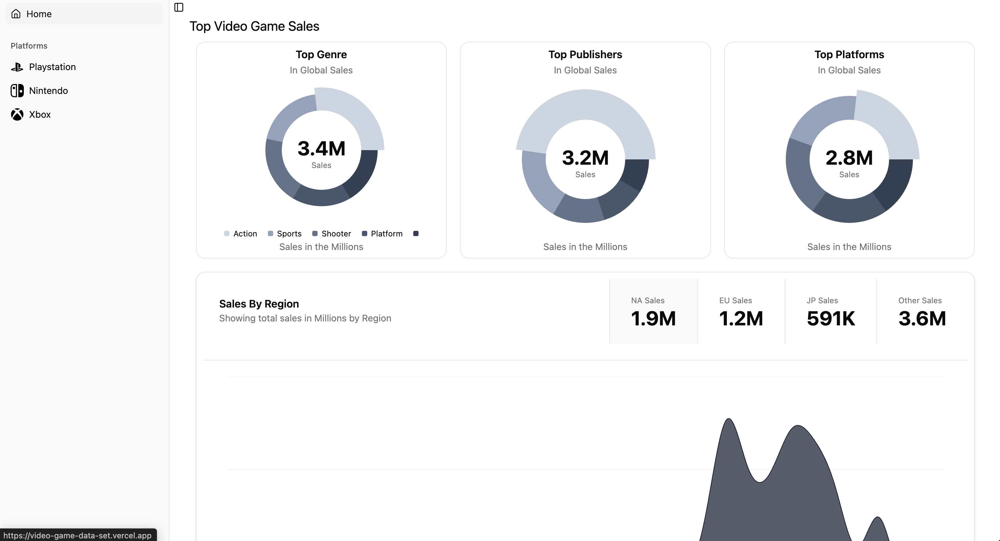

# FastAPI & Next.js Project


## Overview
This project is a **Next.js** dashboard that visualizes sales data by ingesting data from an external FastAPI service: [Video Game Sales API](https://github.com/jabercrombia/video-game-sales-api).

## Project Structure
```
myproject/
│-- pages/          # Next.js pages
│-- components/     # Reusable UI components
│-- public/         # Static assets
│-- package.json    # JavaScript dependencies
```

## Setup & Installation
### Frontend (Next.js)
1. Install dependencies:
   ```sh
   npm install
   ```
2. Run the Next.js development server:
   ```sh
   npm run dev
   ```

## API Integration
- The dashboard fetches sales data from the external FastAPI service: [Video Game Sales API](https://github.com/jabercrombia/video-game-sales-api).
- The API repository is available at: [GitHub - Video Game Sales API](https://github.com/jabercrombia/video-game-sales-api).
- Uses `fetch` or Axios to retrieve and display real-time sales insights.

## Future Improvements
- Enhance UI with interactive charts and filters
- Implement caching for optimized performance
- Deploy to production using Vercel

Feel free to contribute and enhance the project!

